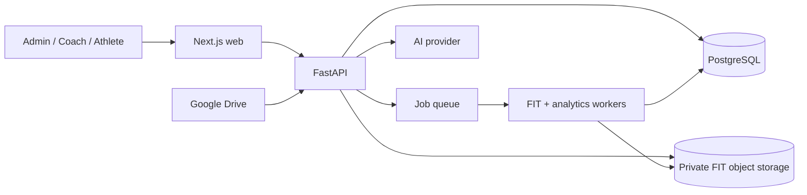

# System Architecture

## Context



For local MVP, API and worker may run in one process and files may use a private local directory. Production separates workers, uses managed PostgreSQL, Redis/SQS-like jobs, and encrypted object storage.

## Components

- **Web:** login, athlete switcher for authorized coaches, uploads, import status, charts, activity detail, settings.
- **API:** session auth, RBAC and athlete scoping, upload streaming, Drive OAuth/folder mapping, read APIs, audit.
- **Import worker:** file validation, FIT decoding, developer-field registry, normalization, idempotent persistence.
- **Analytics worker:** activity metrics, daily load, athlete aggregates, projections, metric versioning.
- **Insight service:** deterministic evidence selection, structured LLM response, policy validation, caching.

## Import state machine

`queued -> stored -> decoding -> normalized -> analyzing -> complete`

Terminal/side states: `duplicate`, `rejected_non_running`, `failed_retryable`, `failed_permanent`. Each transition is timestamped. Database writes for a parsed activity are transactional; retries upsert by stable keys.

## FIT normalization pipeline

1. Hash and store immutable source bytes.
2. Decode file/session/lap/event/device-info/developer-data-id/field-description/record messages.
3. Build a developer-field registry keyed by developer data index + field definition number.
4. Resolve units, scale/offset, native-field override, and normalized aliases.
5. Determine activity sport/subsport from session/sport messages; reject non-running.
6. Select power source with provenance: Stryd developer power when positively identified, otherwise native FIT power. Keep both values if both exist.
7. Normalize timestamps to UTC while preserving local offset; align samples without fabricating missing values.
8. Derive moving state from timer events and gaps; calculate grade over a smoothed distance window.
9. Validate ranges and coverage, persist raw decoded payload plus canonical rows.
10. Compute activity then longitudinal analytics.

## Security and privacy

- Argon2id PIN hashing with independent pepper; constant-time verification.
- Secure, HTTP-only, SameSite cookies; CSRF protection for mutations; short sessions and rotation.
- Rate limit by normalized username, IP, and device; generic login errors and audited lockouts.
- Every query is scoped by tenant/user/athlete authorization. Prefer PostgreSQL row-level security in production.
- OAuth refresh tokens encrypted with a KMS-backed key. Request Drive read-only scope.
- Private storage, signed short-lived access, malware/size checks, retention controls, and location privacy.
- Secrets never enter logs. Audit authentication, exports, mappings, role changes, imports, and insight generation.

## Reliability and observability

- Correlation IDs connect upload/import/activity/analytics logs.
- Metrics: queue latency, decode duration, failure reason, duplicate rate, field coverage, analytics freshness.
- Dead-letter queue and admin retry/reprocess controls.
- Parser and metric versions enable deterministic reprocessing.
- Golden FIT fixtures include native-only, Stryd developer fields, pauses, laps, treadmill, missing GPS/HR, corruption, and duplicate files.

## API surface (MVP)

```text
POST   /v1/auth/login                 username + PIN
POST   /v1/auth/logout
GET    /v1/me
GET    /v1/athletes
POST   /v1/athletes
POST   /v1/athletes/{id}/fit-files
GET    /v1/imports/{id}
PUT    /v1/athletes/{id}/drive-folder
POST   /v1/athletes/{id}/drive-sync
GET    /v1/athletes/{id}/dashboard
GET    /v1/athletes/{id}/activities
GET    /v1/activities/{id}
GET    /v1/activities/{id}/series
GET    /v1/athletes/{id}/analytics
POST   /v1/athletes/{id}/insights
```

