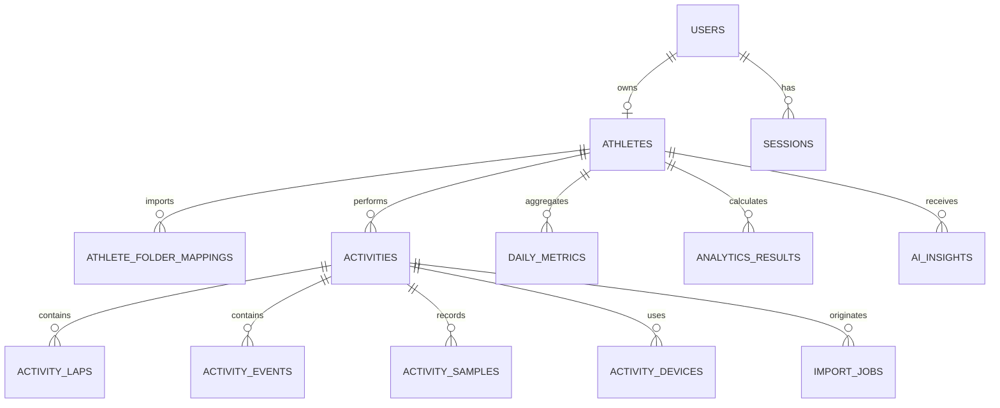

# Database Schema

The executable starter DDL is in `infra/sql/001_init.sql`. UUIDs are externally safe identifiers; UTC `timestamptz` is used throughout. High-volume samples are separated from activity metadata and indexed by activity/time. Partition or convert the samples table to a Timescale hypertable as volume grows.

## Main relationships

## Design decisions

- `source_hash` plus athlete identity prevents duplicate uploads. Drive identity also uses provider file ID + version.
- `raw_fields jsonb` retains unmapped values; canonical columns enable fast analytics.
- Power columns coexist: `native_power_w`, `stryd_power_w`, selected `power_w`, and `power_source`.
- Athlete mass and zone settings are effective-dated so historical W/kg remains reproducible.
- Analytics are immutable versioned results keyed by metric, period, and algorithm version.
- Import warnings and field coverage are data, not log-only details.

